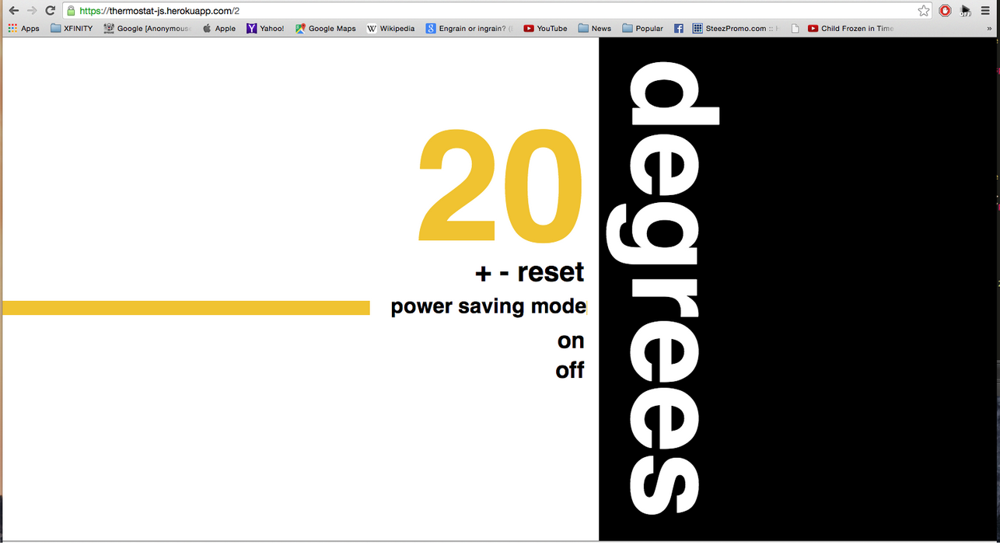
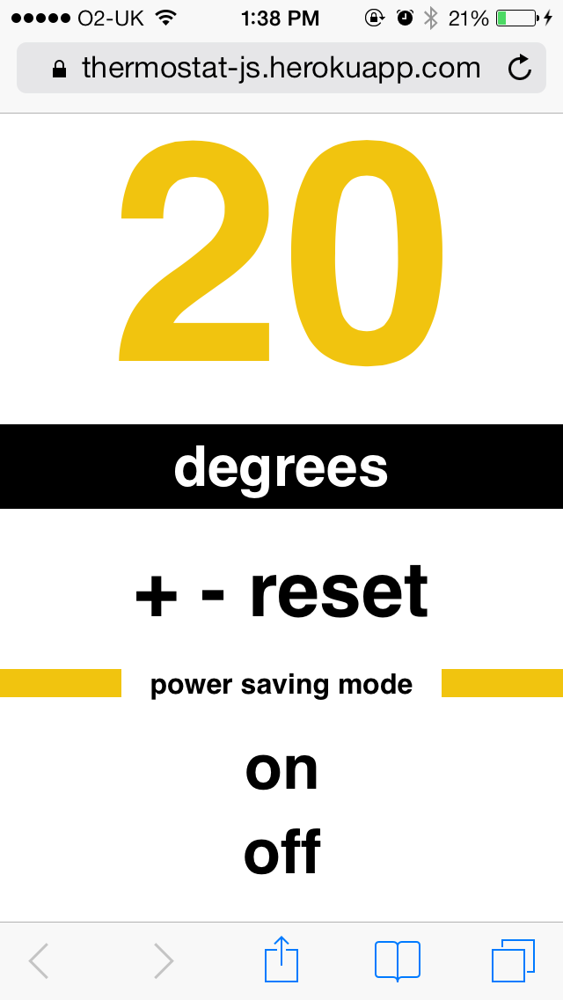

Thermostat
==========
Week 5 JavaScript Project
-------------------------
The heating at Makers Academy is broken and in rebellion we have programmed a thermostat.

Screen shots
-----

<div align="center">
        
</div>
<p></p>

<div align="center">
        
</div>


Heroku (live)
-----
[Thermostat simple]: https://thermostat-js.herokuapp.com
[Thermostat simple]
[Thermostat design]: https://thermostat-js.herokuapp.com/2
[Thermostat design]

Objectives of exercise
----
- Getting warm!
- Learning JavaScript, JQuery and Jasmine
* Test-Driven-Development
* Pair Programming

Technologies used
----
- Javascript
- jQuery
- Jasmine
- Sinatra
- Ruby
- Html
- CSS
- Git
- SublimeText


Requirements
----
- [x] Thermostat starts at 20 degrees
- [x] You can increase the temp with the up button
- [x] You can decrease the temp with the down button
- [x] The minimum temperature is 10 degrees
- [x] If power saving mode is on, the maximum temperature is 25 degrees
- [x] If power saving mode is off, the maximum temperature is 32 degrees
- [x] Power saving mode is on by default
- [x] You can reset the temperature to 20 by hitting the reset button
- [x] thermostat should color the display based on energy usage - < 18 is green, < 25 is yellow, otherwise red

How to clone this repo
----
```sh
git clone https://github.com/HannahCarney/Thermostat.git
```

How to run tests
----
```sh
cd Thermostat
open SpecRunner.html
```

Pair Partner
----
We are [Hannah] and [Josh], from the December 2014 cohort of Makers Academy, London!
[Hannah]:https://github.com/HannahCarney
[Josh]:https://github.com/Bebbs
